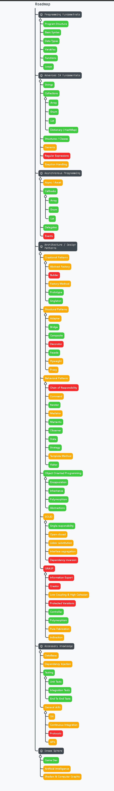

# Roadmap Image Preview

# Roadmap Table Example

### | **Programming Fundametnals** |
| _Name_ | _Status_ |
|---|---|
| Program Structure | Done |
| Basic Syntax | Done |
| Data Types | Done |
| Variables | Done |
| Functions | Done |
| Loops | Done |

### | **Advanced C# Fundamentals** |
| _Name_ | _Subitems_ | _Status_ |
|---|---|---|
| Strings |  | Done |
| Collections |  | Done |
|  | Array | Done |
|  | Enum | Done |
|  | List | Done |
|  | Dictionary ( HashMap) | Done |
| Structures / Classes |  | Working on it |
| Generics |  | Done |
| Regular Expressions |  | Stuck |
| Exeption Handling |  | Working on it |

### | **Asynchronous Programming** |
| _Name_ | _Subitems_ | _Status_ |
|---|---|---|
| Async / Await |  | Working on it |
| Callbacks |  | Done |
|  | Tasks | Done |
|  | Actions | Done |
|  | Anonymous Functions | Done |
| Delegates |  | Done |
| Events |  | Stuck |

### | **Architecture / Design Patterns** |
| _Name_ | _Subitems_ | _Status_ |
|---|---|---|
| Creational Patterns |  | Working on it |
|  | Abstract Factory | Working on it |
|  | Builder | Stuck |
|  | Factory Method | Working on it |
|  | Prototype | Done |
|  | Singleton | Done |
| Structural Patterns |  | Working on it |
|  | Adapter | Working on it |
|  | Bridge | Done |
|  | Composite | Done |
|  | Decorator | Stuck |
|  | Facade | Done |
|  | Flyweight | Working on it |
|  | Proxy | Working on it |
| Behavioral Patterns |  | Working on it |
|  | Chain of Responsibility | Working on it |
|  | Command | Working on it |
|  | Iterator | Done |
|  | Mediator | Working on it |
|  | Memento | Done |
|  | Observer | Done |
|  | State | Done |
|  | Strategy | Done |
|  | Template Method | Working on it |
|  | Visitor | Done |
| Object Oriented Programming |  | Done |
|  | Encapsulation | Done |
|  | Inheritance | Done |
|  | Polymorphism | Done |
|  | Abstractions | Done |
| SOLID |  | Working on it |
|  | Single-responsibility | Done |
|  | Open–closed | Working on it |
|  | Liskov substitution | Working on it |
|  | Interface segregation | Working on it |
|  | Dependency inversion | Stuck |
| GRASP |  | Stuck |
|  | Information Expert | Stuck |
|  | Creator | Stuck |
|  | Low Coupling & High Cohesion | Working on it |
|  | Protected Variations | Stuck |
|  | Controller | Done |
|  | Polymorphism | Done |
|  | Pure Fabrication | Working on it |
|  | Indirection | Working on it |

### | **Accessory Knowledge** |
| _Name_ | _Subitems_ | _Status_ |
|---|---|---|
| DataBases |  | Working on it |
| Dependency Injection |  | Working on it |
| Testing |  | Done |
|  | Unit Tests | Done |
|  | Integration Tests | Working on it |
|  | End To End Tests | Done |
| General skills |  | Working on it |
|  | Git | Working on it |
|  | Continuous Integration | Working on it |
|  | Protocols | Stuck |
|  | APIs | Working on it |

### | **Dream Sphere** |
| _Name_ | _Status_ |
|---|---|
| Game Dev | Done |
| Artificial Intelligence | Working on it |
| Shaders & Computer Graphic | Working on it |